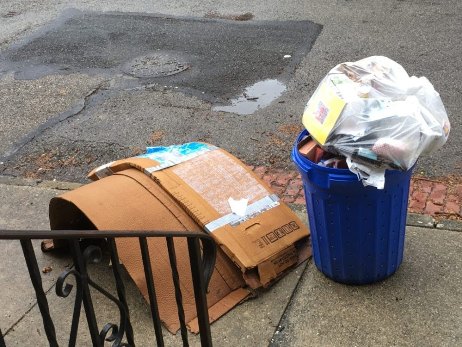

-----
  
### It's a vivid memory...

It's Tuesday - recycling night in the Heights, Jersey City. One by one, neighbors
grab the usual bins for cardboard and bottles - dragging them to the curb.

"Wow it's really coming down!"

That's a shame, because by the time the sanitation workers come by they will have
a soggy mess to contend with. Wait, this happened last week too... talk about *deja vu*!
  
<br/>
<center>
{width=350px}

</center><br/>

**"It *always* rains on cardboard night!"**
  ...this became a sort of mantra between my friends and I some years back. It did seem
uncanny, to the point where I was ready to believe that we had endured some sort
of statistical anomaly in our years together.

-----
  
### A textbook case of bias
  
All humans (and data) suffer from biases. This specific case is something called
[Negativity Bias](https://www.psychologytoday.com/us/articles/200306/our-brains-negative-bias), which means the unpleasant memories of sloshy cardboard seemed to far outweigh/outnumber
the mundane, dry nights.

As much as I'd love to, it's impossible to turn this cognitive switch on and off.
I *do* believe that a disproportionate number of recycling nights occurred on rainy
days!

However, those of us in the analytics profession are equipped to answer things like
this more definitively. Below, I intend to.

-----
  
### NOAA public datasets

The [National Centers for Environment Information](https://www.ncdc.noaa.gov/)
(part of the National Oceanic and Atmospheric Administration) provide
the public with various datasets pertaining to climate in the US, gathered
from a national network of weather stations and other meteorological instruments.

I was able to use the [Find a Station](https://www.ncdc.noaa.gov/cdo-web/datatools/findstation) tool to access
daily weather summaries for Newark International Airport, which is about 20 minutes
away and should serve as an accurate location for historical precipitation figures.  
  
  
```{r, include=FALSE}
# Basic includes for the markdown
library('dplyr')
library('readr')
library('knitr')
library('kableExtra')
library('ggplot2')
library('lubridate')

theme_rutz <- function () { 
    theme_bw(base_size=13, base_family="Ubuntu") %+replace% 
        theme(
            panel.background  = element_blank(),
            plot.background = element_rect(fill="transparent", colour=NA), 
            legend.background = element_rect(fill="transparent", colour=NA),
            legend.key = element_rect(fill="transparent", colour=NA),
            panel.grid.major = element_line(color = 'gray90'),
            panel.grid.minor = element_line(color=NA)
        )
}

nw <- readr::read_csv("noaa_newark_data.csv")
```
<br/>
*Weather station data example - available as .csv*
```{r, echo=FALSE}
# Preview table of the raw NOAA data
nw %>%
  #select(1:9) %>%
  filter(!is.na(WT01) | !is.na(WT02)) %>%
  head(35) %>%
  kable() %>%
  kable_styling(c('condensed'), fixed_thead = T, font_size = 11) %>%
  scroll_box(height = "200px")
```
<br/>
The NCEI also provides the corresponding  [data definitions](https://www.ncdc.noaa.gov/cdo-web/datasets) for the weather type "WT".
Here is the direct [link](https://www1.ncdc.noaa.gov/pub/data/cdo/documentation/GHCND_documentation.pdf).  

WT16 is described as *"Rain (may include freezing rain, drizzle, and freezing drizzle)"*
which sounds like an appropriate description of what we're after.

-----

### The chi-squared test

Let's turn this vague superstition into something testable.

> H~1~: It rains disproportionately on different weekdays.  
> H~0~: It rains equally across every weekday.

There is a very straightforward approach for this called the [chi-squared Goodness of Fit test](https://stattrek.com/chi-square-test/goodness-of-fit.aspx). This test is only
used for discrete distributions of categorical variables. This is what WT16 represents,
a binary classification of rainy weather which we can count in a contingency table.

-----

### Data preparation

This section will explain a few transformations with example code.  
<br/>
**[Click here to skip past the data prep](#skip_prep)**.
<br/>
<br/>

The available data is relatively clean, so it is easily imported without
specifying types by the readr package. As a bonus, the DATE field politely defaults
to date type.

```{r, warning=FALSE, message=FALSE}
nw <- readr::read_csv("noaa_newark_data.csv")

# The Date is correct
str(nw$DATE)

# WT16 (rain) is 1 when true and NA when false
str(nw$WT16)
table(nw$WT16, useNA = 'always')
```

<br/>
In summary, we need to make the following adjustments:  

  * Clean up WT16 to remove NA's
  * Add the Weekday (it's part of our hypothesis)
  * Drop and rename to be friendlier
  * (optional) Adding a season as available feature

```{r}
# This will be a lookup table for our calculated season
seasons <- c(
  'Mar' = 'Spring', 'Apr' = 'Spring', 'May' = 'Spring',
  'Jun' = 'Summer', 'Jul' = 'Summer', 'Aug' = 'Summer',
  'Sep' = 'Autumn', 'Oct' = 'Autumn', 'Nov' = 'Autumn',
  'Dec' = 'Winter', 'Jan' = 'Winter', 'Feb' = 'Winter'
)

# Enriching our initial dataset as described
nw <- nw %>%
  mutate(Weekday = lubridate::wday(DATE, label = T)) %>%
  mutate(Season = seasons[lubridate::month(DATE, label = T)]) %>%
  mutate(Season = factor(Season, levels = c('Spring', 'Summer', 'Autumn', 'Winter'))) %>%
  mutate(Weather = ifelse(is.na(WT16), 'Clear', 'Rain'))
```
<br/>
Finally we prep our tidy contingency table for convenience later on.

```{r}
# Contingency table
ct <- nw %>%
  group_by(Weekday, Weather, Season) %>%
  summarize(Count = n())
```
-----
### Is Tuesday special?

Let's have a look!

```{r, echo=FALSE, fig.height=3}
ct %>%
  filter(Weather == 'Rain') %>%
  ggplot(aes(x = Weekday, fill = Season)) +
  geom_bar(aes(weight = Count), color = 'gray60') +
  coord_flip() +
  labs(
    title = 'Rainy Days',
    subtitle = 'Newark Intl Airport, Jan 2012 thru Jun 2018',
    y = '',
    x = ''
  ) +
  theme_rutz() +
  scale_fill_brewer(palette = 'Pastel1', direction = -1) +
  annotate(geom = 'text', x = 'Tue', y = 25, label = 'Recycling Night', family = 'Ubuntu', size = 6, color = 'white', alpha = .9) +
  geom_hline(yintercept = 33, linetype = 'dashed', color = 'black')
```

Test

<a name="skip_prep"/>

Test2